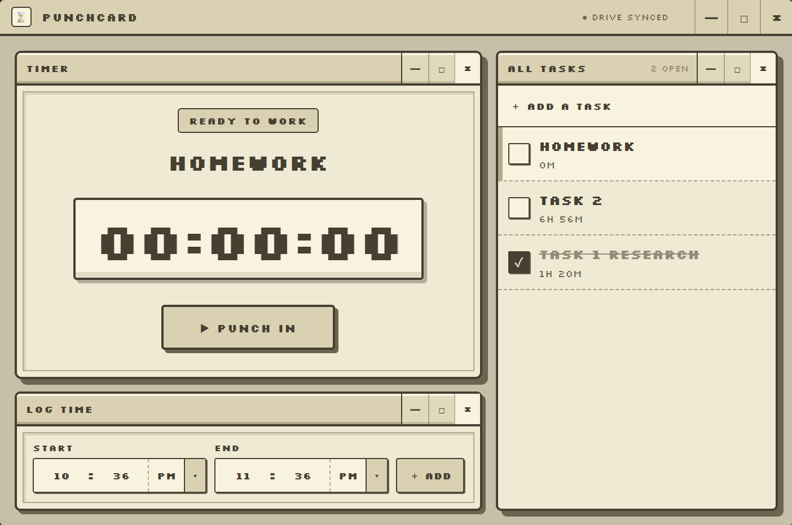

# Punchcard



A small, local-first desktop time tracker with a retro Macintosh-inspired interface.

## Features

- Create, complete, and reopen tasks
- Track time with punch in, pause, and punch out controls
- Log time manually, including ranges that cross midnight
- View totals for the last 24 hours, 7 days, 30 days, or all time
- Keep data locally in SQLite
- Optionally sync tasks and time entries through Google Drive

## Run locally

Requires Go 1.23+, Node.js 20+, and the [Wails v2 CLI](https://wails.io/docs/gettingstarted/installation/).

```powershell
cd frontend
npm install
cd ..
wails dev
```

#### Then Build Locally

```powershell
wails build
```

## Docs

- [Development and architecture](docs/development.md)
- [Google Drive setup](docs/google-drive.md)